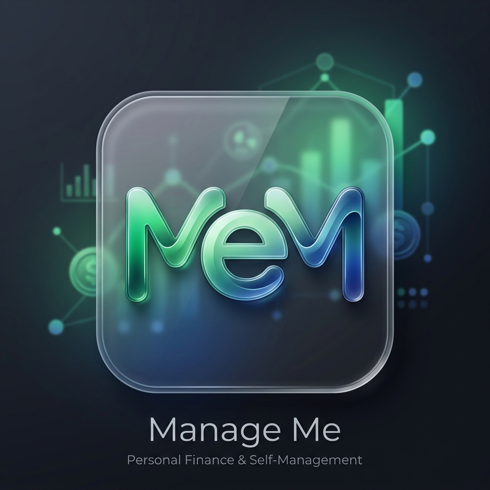

# 📊 MeM (Manage Me) - Desktop App

A premium, modern desktop application for managing complex income sources, tracking work hours, and automating monthly distributions.



## 🚀 Key Features

-   **Desktop Native**: Runs as a standalone Windows application with a beautiful, sleek theme.
-   **Time Tracker**: Log daily work hours for different clients/projects with hourly rates and status tracking (Unpaid, Invoiced, Paid).
-   **Income Sources**: Manage long-term contracts with automated monthly withdrawal reminders.
-   **One-Click Distributions**: Split your income across family, bills, and savings using reusable templates.
-   **Payment Ledger**: A dedicated history for salary receipts, gifts, and project payments.
-   **Savings Goals**: Track big purchases with animated progress bars and currency intelligence.
-   **Multi-Currency Support**: Unified dashboard for DKK, SEK, and EUR balances.
-   **RTL & Localization**: Fully localized for Arabic (RTL) and English.
-   **PDF Reporting**: Export monthly summaries and balance receipts as professional documents.

## 💻 Tech Stack

-   **Frontend**: Next.js 14, React 18, Lucide Icons.
-   **Styling**: Premium Vanilla CSS (Glassmorphism, Dark/Light modes).
-   **Database**: SQLite (via `better-sqlite3`).
-   **Desktop**: Electron Wrapper.

## 🛠️ Getting Started (Development)

### Prerequisites

-   Node.js (LTS)
-   npm

### Installation

```bash
npm install
```

### Running the Desktop App

To start the app in a standalone window with hot-reload:

```bash
npm run electron:dev
```

### Running the Web Version

If you prefer to run it in your browser (localhost:3000):

```bash
npm run dev
```

## 📦 Building the Installer

To generate a native Windows `.exe` installer:

```bash
npm run electron:build
```

The installer will be generated in the `dist/` directory.

## 📁 Documentation

Detailed documentation on project structure, database schema, and design standards can be found in the [doc/](doc/README.md) folder (see `PROJECT_GUIDE.md`).

---

*Powered by MeM Design System*
